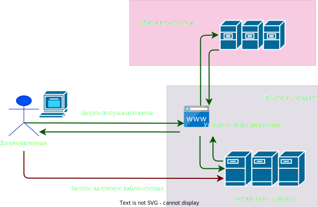

# Server Side Request Forgery (SSRF)

SSRF (Server Side Request Forgery) - подделка запроса c стороны сервера, уязвимость которая позволяет отправлять HTTP-запросы от имени сервера к внешним или внутренним ресурсам системы. К данной атаке уязвимы web-приложения, которые взаимодействуют с сторонними сервисами или загружают данные по ссылкам. [OG](https://habr.com/ru/companies/solarsecurity/articles/590673/)




Что может делать SSRF `->`

- Обойти ограничения 
- Извлечь конфиденциальную информацию
- Прочитать локальные файлы 
- Получить доступ к всем внутренним ресурсам

Пример `->`

```Python
from flask import Flask, request
import requests

app = Flask(__name__)

@app.route('/load_image', methods=['GET'])
def load_image():
    url = request.args.get('url')
    response = requests.get(url)
    return response.content, 200, {'Content-Type': 'image/jpeg'}

if __name__ == '__main__':
    app.run()

```

Тут приложение имеет функцию загрузки изображения `load_image` через параметр `url` и последующее его отображение. _Тут нет безопасной обработки URL адреса_

```URL
GET /load_image?url=http://localhost:8080/admin
```

Если нет безопасной обработки `URL`, то можно в запрос вводить любые конструкции. Если в периметре компании есть внутренний сервис доступный по адресу `http://localhost:8080/admin`, сервер вернет положительный ответ злоумышленнику.

## Защита от SSRF

Чтобы устранить данную уязвимость, можно внедрить белый список допустимых доменов.

```Python
ALLOWED_DOMAINS = ['example.com', 'another-example.com']

def is_allowed_url(url):
    return any(url.startswith(f'http://{domain}') or url.startswith(f'https://{domain}') for domain in ALLOWED_DOMAINS)

@app.route('/load_image', methods=['GET'])
def load_image():
    url = request.args.get('url')
    if not is_allowed_url(url):
        return 'Access Denied', 403

    response = requests.get(url)
    return response.content, 200, {'Content-Type': 'image/jpeg'}

```

Настройки сервера:
- Разбить сеть на сегменты и ограничить доступ к ресурсам за их пределами для снижения влияния SSRF.
- Применение политики брандмауэра "запретить по умолчанию" для фильтрации трафика.
  
Код:
- Проверка всех входных данных, предоставленных пользователем.
- Используйте схему URL-адреса, порт и место назначения с положительным списком разрешений.

Classification:
--
[[ASVS 4.0.3]]
[[ASVS 5.2.6]]
[[ASVS 12.6.1]]

#A10-21
#CWE-918

