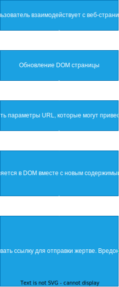

# XSS

_**XSS - Cross-Site Scripting**_ _**Межсайтовый скриптинг**_

В основе XSS атаки лежит внедрение произвольного JavaScript кода в веб приложение, которое на стороне клиента (браузер пользователя) выполняет зловредные действия.

Основные методы вызова JavaScript из HTML:

```JavaScript
<script>...</script>
TEST</a>
<a href="javascript:...">Хочешь денег? Много денег?</a>
<iframe src="javascript:...">
```

XSS атаки классифицируются по 3 основным признакам:

* Хранимые (Stored) XSS (код перед выполнением храниться в базе данных)
* Отраженные (Reflected) XSS (код не храниться в базе данных, а отражается от сервера)
* DOM-Based XSS (код одновременно храниться и выполняется в браузере)

Что может злоумышленник `->`

1. Злоумышленник может попытаться получить креды ("credentials") пользователя и войти в его аккаунт.
2. Злоумышленник может перенаправить пользователя на поддельную страницу и украсть cookies.
3. Многое другое

Как можно внедрить код ? Код можно внедрить через поля ввода `->` форма ввода комментария, форма логина и пароля, форма заполнения информации о твоей бывшей (или …). `(o-_-o)` Если данные сохраняются в базу данных то `->` При генерации `HTML` страницы, данные из БД передаются в шаблон. Если отключены механизмы защиты от XSS, то сохраненный код в базе данных при вызове будет выполнен. `Stored XSS`


Самый простой тип атаки `->` Злоумышленник через форму может внедрить JavaScript код. API получая информацию из формы записывает ее в базу данных. Пользователь делая запрос на получение информации получает "Открытку `->` **Рофлан здарова**", в открытке вредоносный скрипт который выполнятся в фоне. _Пользователь может получить не только открытку, зависит все от среды и фантазии злоумышленника._

Reflected XSS (отражённый XSS) - злоумышленник может внедрить вредоносный скрипт в URL-адрес или параметр запроса, который отражается сервером в ответе и выполняется браузером жертвы. [OG](https://www.securitylab.ru/glossary/reflected\_xss/) Reflected XSS работают идентично Stored XSS, но они не хранятся в базе данных. Reflected XSS воздействует напрямую на код клиента в браузере.


Пример `->`

```PHP
<p>
Почему не работаем, <?php echo($_GET["name"]); ?>!
</p>
```

```URL
/work.php?name=<script>alert('Пусь')</script>
```

XSS внутри значения атрибута -> что тогда?

Форма ->

```URL
/work.php?name=<script>alert('Кусь')</script>
```

```PHP
<form action="work.php" method="POST">
	<input name="name" value="<script>alert('Кусь')</script>">
</form>
```

При таком примере, XSS не будет работать так как не закрыт атрибут.

Решение ->

```URL
/work.php?name=<script>alert('Кусь')</script>
```

```PHP
<form action="work.php" method="POST">
	<input name="name" value=""><script>alert('Кусь')</script>" >
</form>
```

XSS внутри ссылки -> ДЭ?

```PHP
<a href="<?php echo($_GET["returnUrl"]); ?>">Курс влететь в IT за 0 рублей </a>
```

```URL
/itkurs.php?returnUrl=javascript:alert('ЯхААА Влетел ***')
```

DOM-Based XSS DOM (Document Object Model) программный интерфейс (API) для HTML и XML документов. DOM загружает весь документ в память и представляет его в виде дерева, он предоставляет возможность изменять содержимое, стиль и структуру документа. DOM соединяет веб-страницу с языками описания сценариев либо языками программирования. [OG](https://developer.mozilla.org/ru/docs/Web/API/Document\_Object\_Model/Introduction)

Главное различие между DOM-Based XSS и Stored XSS, Reflected XSS в том, что атака на основе DOM никогда не требуют взаимодействия с сервером. Вредоносный код не отсылается из браузера, в качестве HTTP-запроса.

Пример ->

```JavaScript
<body> 
	<script>document.write(location.href);</script> 
</body>
```

* `document.write` - метод JavaScript, который используется для вывода данных `->` текст, HTML и тд.
* `location.href` - берет текущий URL-адрес

```URL
/dooMer.html#<script>alert(document.cookie);</script>
```

Злоумышленник может контролировать параметры URL, тем самым при отправке данной ссылки жертве, он получить `cookie` жертвы.

Кстати возможно, что данный пример не будет работать к примеру в Microsoft Edge Browser. Есть вероятность, что ошибка в реализации DOM, поставляемой одним браузером, не будет присутствовать в реализации DOM, поставляемой другим браузером.

Еще один момент -> DOM-Based XSS практический невозможно обнаружить с помощью инструментов статического анализа или любого другого типа популярного сканера.



**Mutation-Based XSS**

Марио Хейдериха (Mario Heiderich) в 2013 опубликовал статью под названием «mXSS Attacks: Attacking well-secured Web-Applications by using innerHTML Mutations». Данная статься одна из первых которая вводит новое описание XSS-атак, которое было названо Mutation-Based XSS (mXSS)

Данная атака на данный момент возможна на все основные браузеры. Надо глубоко понимать методы, с помощью которых браузер выполняет оптимизацию и условия при рендеринге узлов DOM.

mXSS направлен на обход защитных механизмов (обман санитизации (фильтрации) данных), применяемых на стороне сервера или клиента, путем введения вредоносного кода, который после прохождения санитизации превращается в активный вредоносный код для пользователей.

Пример I

```HTML
 <noscript><p title="</noscript>">
```

`->`

```HTML
<noscript><p title="</noscript>
    
    "">
    "
```

Пример L

```HTML

```

`->`

```HTML

```

По некоторым оценкам XSS присутствует более чем в 2/3 web-приложений в интернете. Существует несколько способов для снижения риска XSS:&#x20;

* CSP
* Проверка ввода&#x20;
* Кодирование вывода&#x20;
* Санитизация Хорошей практикой является внедрением всех механизмов защиты.
