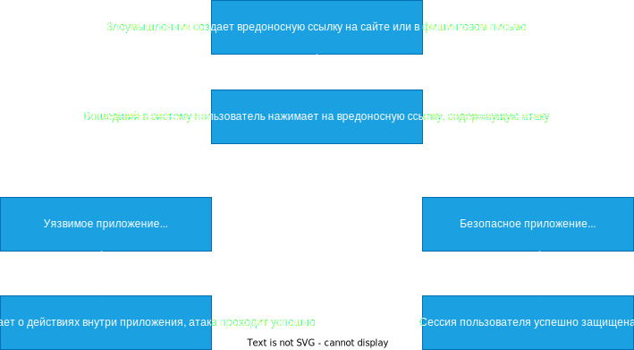

# Cross Site Request Forgery (CSRF)

CSRF (Cross-Site Request Forgery) Межсайтовая подделка запроса - атака на web-приложение, при которой злоумышленник обманом заставляет пользователя перейти по ссылке, которая пытается выполнить несанкционированные действия от имени аутентифицированного пользователя, направленные против веб-приложения. При этом против приложения используются функции самого приложения.




Пример `->`
- Пользователь аутентифицирован на сайте `animehub.gz`. У пользователя есть сессия в `Cookie`.

__Cookie - небольшой фрагмент данных, отправленный web-сервером и хранимый на компьютере пользователя, браузер всякий раз пересылает этот фрагмент данных веб-серверу в составе HTTP - запроса.__

```Server 
Set-Cookie: name=value; expires=date; path=/; domain=.example.org; secure; httponly;
```

```Client 
Cookie: name=newvalue;
```

- Пользователю пришло письмо на почту о выходе нового сезона его любимого сериала, с ссылкой на эксклюзивную первую серию.
- Пользователь перешел по ссылке.
- На странице его встречает форма в виде `->`

```HTML
<form action="http://animehub.gz/send" method="POST"> 
	<input type="hidden" name="col" value="Удалить историю просмотров">
	... 
</form>
```

- JavaScript вызывает `form.submit`, отправляя таким образом форму на `animehub.gz`.
- `animehub.gz` проверят `Cookie`, видит что пользователь аутентифицирован и обрабатывает форму. (Минус история `(;;;*_*)`)

`Cookie` не гарантируют, что форму создал именно пользователь. Они только удостоверяют личность, но не данные.

Методы HTTP которые подвержены CSRF.

1. `GET, HEAD, OPTIONS, TRACE `-   Методы  не подвежены CSRF, эти методы предназначены только для получения информации и не изменяют состояние сервера.

2. `POST, PUT, DELETE и PATCH`  - Методы должны быть защищены от CSRF.

