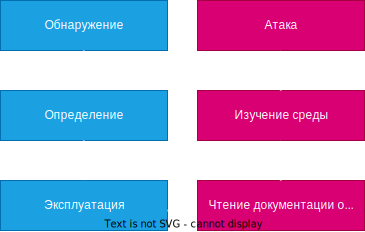
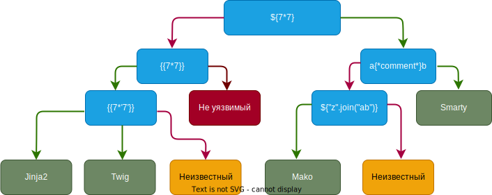

# Server Side Template Injection (SSTI)

SSTI (Server Side Template Injection) - внедрение шаблонов на стороне сервера, злоумышленник может внедрить вредоносный код в шаблон, который затем выполняется на стороне сервера для генерации динамического контента.

Пример PHP, twig `->`

```PHP
$output = $twig->render("Приветик" . $_GET['name']);
```

```URL
https://www.bts-official.us/?name={{ 7 * 7 }}
->
Приветик 49
```

Пример Flask, Jinja2 `->`

```Python
from flask import Flask, request, render_template_string

app = Flask(__name__)

@app.route('/greeting')
def greeting():
    user_input = request.args.get('name')
    template = 'Вот они слева направо, {{ name }}!'
    return render_template_string(template, name=user_input)

if __name__ == '__main__':
    app.run()

```

```URL
https://www.bts-official.us/greeting?name={{ 7 * 7 }}
->
Вот они слева направо, 49!
```


James Kettle в 2015 году опубликовал статью «Server-Side Template Injection» в которой подробно рассказал об методах поиска уязвимости. [OG](https://portswigger.net/research/server-side-template-injection)

# Методология внедрения вредоносной конструкции в шаблон.




**Обнаружение 

Первый шаг - использовать инструменты фаззинга шаблонов с последовательностью специальных символов используемых в шаблонах `${{<%[%'"}}%\`. [OG](https://github.com/epinna/tplmap)

**Определение 

Определение механизма работы шаблона. Существует большое количество языков шаблонов которые синтаксисом похожи друг на друга. Их конструкции выбраны так специально чтобы не конфликтовать с символами HTML.

Если сервер будет выдавать ошибки -> можно найти движок, вызывая ошибки. Некоторые полезные нагрузки. [OG](https://book.hacktricks.xyz/pentesting-web/ssti-server-side-template-injection#:~:text=If%20you%20are%20lucky%20the%20server%20will%20be%20printing%20the%20errors%20and%20you%20will%20be%20able%20to%20find%20the%20engine%20used%20inside%20the%20errors.%20Some%20possible%20payloads%20that%20may%20cause%20errors%3A)

| `${}`       | `{{}}`       | `<%= %>`        |
| ----------- | ------------ | --------------- |
| `${7/0}`    | `{{7/0}}`    | `<%= 7/0 %>`    |
| `${foobar}` | `{{foobar}}` | `<%= foobar %>` |
| `${7*7}`    | `{{7*7}}`    | \`\`            |

Если поиск движка через ошибки терпит крушение `->` тестируем конструкции для разных языков шаблонов. Обычно внедряют произвольные математические конструкции по типу `${7*7}`.  Для упрощения поиска используют дерево принятия решений.




**Эксплуатация (Чтение, Изучение среды, Атака) 

**Чтение 

__Важно изучить документацию к выявленному механизму шаблонов.__

**Изучение среды

__Если уязвимости не были обнаружены `->` изучаем среду для дальнейшего определения к чему есть доступ в системе. Надо найти объекты которые предоставляет сам шаблонизатор, специфичные объекты для приложения. Объекты, предоставленные разработчиком, особенно вероятно, будут содержать чувствительную информацию и могут различаться между различными шаблонами в рамках одного приложения, поэтому этот процесс лучше всего применять к каждому отдельному шаблону.__

**Атака

__Надо четко понимать и представлять уязвимое приложение для атаки. Приступив к методам проверки безопасности приложения, надо анализировать каждую функцию на возможные уязвимости для их последующего использования. Важно учитывать контекст всего приложения, так как некоторые функции могут быть использованы для эксплуатации специфических особенностей приложения.__


