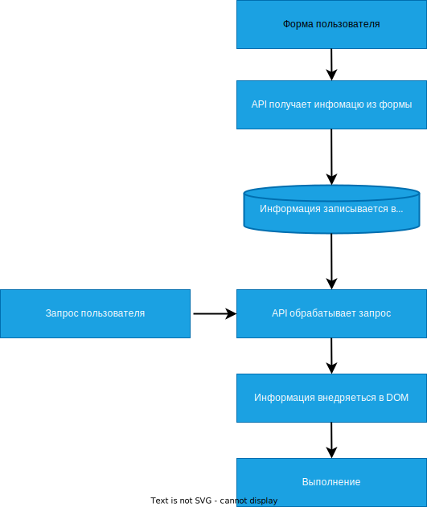

*__XSS - Cross-Site Scripting__*
*__Межсайтовый скриптинг__*

В основе XSS атаки лежит внедрение произвольного JavaScript кода в веб приложение, которое на стороне клиента (браузер пользователя) выполняет зловредные действия.

Основные методы вызова JavaScript из HTML:
```JavaScript
<script>...</script>
TEST</a>
<a href="javascript:...">Хочешь денег? Много денег?</a>
<iframe src="javascript:...">
```

XSS атаки классифицируются по 3 основным признакам:
- Хранимые (Stored) XSS (код перед выполнением храниться в базе данных)
- Отраженные (Reflected) XSS (код не храниться в базе данных, а отражается от сервера)
- DOM-Based XSS (код одновременно храниться и выполняется в браузере)

Что может злоумышленник `->`
1. Злоумышленник может попытаться получить креды ("credentials") пользователя и войти в его аккаунт.
2. Злоумышленник может перенаправить пользователя на поддельную страницу и украсть cookies.
3. Многое другое

Как можно внедрить код ? Код можно внедрить через поля ввода `->` форма ввода комментария, форма логина и пароля, форма заполнения информации о твоей бывшей (или …). `(o-_-o)` Если данные сохраняются в базу данных то `->` При генерации `HTML` страницы сохраненные данные из базы данных передаются в шаблон. Если отключены механизмы защиты от XSS, то сохраненный код в базе данных при вызове будет выполнен. `Stored XSS`



Reflected XSS -  разработчик может брать параметры из URL или тела запроса

```PHP
<p>
Почему не работаем, <?php echo($_GET["name"]); ?>!
</p>
```

```URL
/work.php?name=<script>alert('Пусь')</script>
```

XSS внутри значения атрибута -> что тогда?

Форма ->
```URL
/work.php?name=<script>alert('Кусь')</script>
```

```PHP
<form action="work.php" method="POST">
	<input name="name" value="<script>alert('Кусь')</script>">
</form>
```

При таком примере, XSS не будет работать так как не закрыт атрибут.

Решение ->

```URL
/work.php?name=<script>alert('Кусь')</script>
```

```PHP
<form action="work.php" method="POST">
	<input name="name" value=""><script>alert('Кусь')</script>" >
</form>
```

XSS внутри ссылки -> ДЭ?

```PHP
<a href="<?php echo($_GET["returnUrl"]); ?>">Курс влететь в IT за 0 рублей </a>
```

```URL
/itkurs.php?returnUrl=javascript:alert('ЯхААА Влетел ***')
```


Примеры `->`
Функция `render_template_string` отображает модель в виде `<p>{{ comment }}</p>` в `DOM` но не сохраняет его в базу данных. Таким образом мы можем через `comment` внести зловредный код.

__В реальном приложении Flask по умолчанию уже стоит автоматическое экранирование специальных символов для предотвращения XSS. Специальные символы `&, >, <, ", '`__

Данный пример нужен для понимания

```Python Flask
from flask import Flask, render_template_string

app = Flask(__name__)

@app.route('/')
def index():
    comment = '<script>alert("Ребят, я свой!!! Мне можно доверять доступ к системе управления ядерного арсенала страны")</script>'
    return render_template_string('<p>{{ comment }}</p>', comment=comment)

if __name__ == '__main__':
    app.run()

```

---

`In This` немного изменился алгоритм, сохраняем комментарий в базу данных (Stored XSS). Но даже при таком условии в FLask не будет выполнена атака. Flask автоматический экранирует специальные символы (упоминал выше). Чтобы все "работало" форме надо добавить блоки `->`
`` - отключение автоматического экранирования специальных символов
`{{ comment|safe }}` - safe помечает в шаблоне `comment` как безопасную конструкцию и не экранирует специальные символы.

```Python Flask
@app.route('/', methods=['GET', 'POST'])
def index():
    if request.method == 'POST':
        comment_text = request.form['comment']
        comment = Comment(content=comment_text)
        db.session.add(comment)
        db.session.commit()
        return redirect('/')

    comments = Comment.query.all()
    comment_contents = [comment.content for comment in comments]
    return render_template('index.html', comments=comment_contents)
```

```HTML Form
<!DOCTYPE html>
<html>
<head>
    <title>Flask App - Comments</title>
</head>
<body>
    <h1>Leave a Comment</h1>
    <form method="POST" action="/">
        <textarea name="comment" rows="4" cols="50"></textarea><br><br>
        <input type="submit" value="Save">
    </form>

    <h2>Comments:</h2>
    <div id="commentArea">
        
            <p>{{ comment|safe }}</p>
        
    </div>
</body>
</html>
```


По некоторым оценкам XSS присутствует более чем в 2/3 web-приложений в интернете.
Существует несколько способов для снижения риска XSS: 
- CSP
- Проверка ввода 
- Кодирование вывода 
- Санитизация
Хорошей практикой является внедрением всех механизмов защиты.
